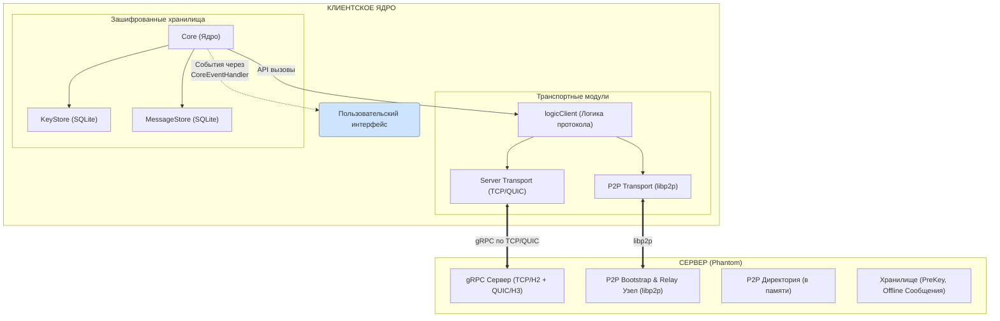
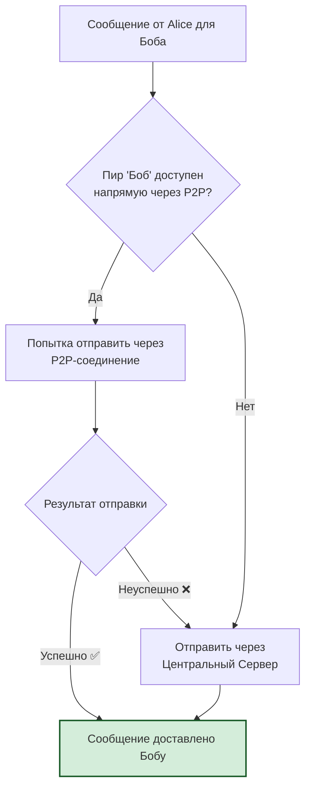
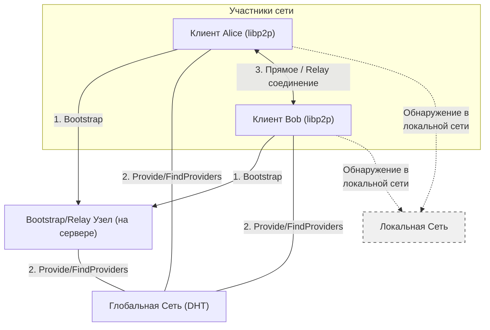

# Техническая Документация: Phantom Secure Messenger (Hybrid PQC & P2P Edition)

**Версия документа:** 2.0
**Дата:** 4 октября 2025 г.

## Оглавление

1.  [**Введение и Философия Проектирования**](#1-введение-и-философия-проектирования)

    1.1. Обзор Системы

    1.2. Ключевые Цели и Принципы

    1.3. Основные Возможности

2.  [**Архитектура Системы**](#2-архитектура-системы)

    2.1. Высокоуровневая Архитектура

    2.2. Архитектура Клиентского Ядра (`Core`)

    2.3. Гибридная Транспортная Модель

    2.4. Детализированная Архитектура P2P-компонента

3.  [**Криптографические Протоколы**](#3-криптографические-протоколы)

    3.1. Гибридный Подход: "Пояс и Подтяжки"

    3.2. Гибридный Протокол Установки Сессии (Hybrid PQXDH)

    3.3. Гибридный Алгоритм Double Ratchet

    3.4. Защита от Атак Повторного Воспроизведения (Replay Attacks)

    3.5. Аутентификация и Целостность

4.  [**Структура Данных и Хранение**](#4-структура-данных-и-хранение)

    4.1. `KeyStore`: Безопасное Хранилище Ключей

    4.2. `MessageStore`: Хранилище Истории Сообщений

    4.3. Схемы Баз Данных

5.  [**Сетевые Протоколы и Транспорт**](#5-сетевые-протоколы-и-транспорт)

    5.1. gRPC и Protobuf

    5.2. Транспортный Уровень: TCP, QUIC и P2P

    5.3. Протокол Обнаружения и Маршрутизации P2P

6.  [**Жизненный Цикл и Потоки Данных**](#6-жизненный-цикл-и-потоки-данных)

    6.1. Инициализация и Запуск Ядра (`Core`)

    6.2. Поток Данных: Отправка Сообщения

    6.3. Поток Данных: Получение Сообщения

    6.4. Поток Данных: Установка Новой Сессии (Handshake)

7.  [**Анализ Безопасности**](#7-анализ-безопасности)

    7.1. Модель Угроз

    7.2. Предоставляемые Гарантии Безопасности

    7.3. Специфические Меры Защиты

    7.4. Известные Ограничения

8.  [**Руководство по Сборке и Развертыванию**](#8-руководство-по-сборке-и-развертыванию)

    8.1. Требования
    
    8.2. Развертывание Сервера
    
    8.3. Сборка Клиента

9.  [**Заключение и Направления для Развития**](#9-заключение-и-направления-для-развития)

---

## 1. Введение и Философия Проектирования

### 1.1. Обзор Системы

**Phantom Secure Messenger** — это модульная, отказоустойчивая и защищенная система обмена сообщениями, разработанная с прицелом на долгосрочную безопасность в постквантовую эпоху. Она сочетает в себе проверенные временем классические криптографические алгоритмы с передовыми постквантовыми (PQC) схемами, реализуя гибридный подход к шифрованию.

Ключевой особенностью системы является ее **гибридная сетевая архитектура**, позволяющая работать как через централизованный сервер, так и в полностью децентрализованной Peer-to-Peer (P2P) сети, или в комбинированном режиме, используя лучшее из обоих миров.

### 1.2. Ключевые Цели и Принципы

*   **Долгосрочная Безопасность (Forward Secrecy)**: Защита от атак типа "Harvest now, decrypt later". Использование PQC KEM (CRYSTALS-Kyber) гарантирует, что даже если злоумышленник сегодня записывает зашифрованный трафик, он не сможет расшифровать его в будущем с помощью квантового компьютера.
*   **Крипто-гибкость (Crypto-agility)**: Гибридный подход (PQC + ECC) обеспечивает безопасность, даже если один из криптографических примитивов (постквантовый или классический) будет скомпрометирован. Это принцип "пояса и подтяжек".
*   **Отказоустойчивость и Децентрализация**: Система спроектирована так, чтобы продолжать функционировать даже при недоступности центрального сервера (в режиме P2P). Клиенты могут находить друг друга и общаться напрямую.
*   **Модульность и Переиспользуемость**: Логика клиента инкапсулирована в автономное ядро (`Core`), которое может быть встроено в различные пользовательские интерфейсы (CLI, GUI, мобильные приложения), взаимодействуя с ними через четко определенный асинхронный API (`CoreEventHandler`).
*   **Надежность Доставки**: Гибридный сетевой режим использует центральный сервер как надежный fallback-механизм для доставки оффлайн-сообщений и обхода сложных сетевых конфигураций (NAT), когда прямое P2P-соединение невозможно.

### 1.3. Основные Возможности

*   **Гибридное End-to-End шифрование** (Kyber + X25519).
*   **Постквантовые цифровые подписи** (Dilithium5).
*   **Мульти-транспортная поддержка**: TCP, QUIC (в перспективе), P2P.
*   **Автоматический выбор транспорта**: Приоритет отдается более быстрым и приватным каналам (P2P > QUIC > TCP).
*   **P2P-сеть на базе `libp2p`**:
    *   Обнаружение пиров через DHT и mDNS.
    *   Обход NAT с помощью Hole Punching и Circuit Relay v2.
*   **Надежная защита от Replay-атак** с использованием `nonce` и временных меток.
*   **Раздельные зашифрованные хранилища** для ключей и сообщений с доступом по PIN-коду (Argon2id).
*   **Безопасная очистка ключей** из памяти при завершении работы (`Zeroize`).

---

## 2. Архитектура Системы

### 2.1. Высокоуровневая Архитектура

Система состоит из двух основных компонентов: **Сервера** и **Клиентского Ядра**.



### 2.2. Архитектура Клиентского Ядра (`Core`)

Ядро (`phantomcore`) является сердцем клиента. Оно абстрагирует всю сложность криптографии и сети от пользовательского интерфейса.

*   **`Core` (`core.go`)**: Главный управляющий объект.
    *   Отвечает за жизненный цикл (старт, стоп, перезапуск).
    *   Инициализирует и управляет всеми подкомпонентами.
    *   Предоставляет публичный API для UI (e.g., `SendMessage`, `GetContacts`).
    *   Владеет экземплярами `KeyStore` и `MessageStore`.

*   **`CoreEventHandler`**: Интерфейс, реализуемый UI, для получения асинхронных событий от `Core` (e.g., `OnMessageReceived`, `OnContactListUpdated`).

*   **`logicClient` (`logic.go`)**: Мозг протокола.
    *   Реализует логику хендшейка (Alice & Bob).
    *   Обрабатывает входящие и исходящие gRPC-пакеты.
    *   Управляет сессиями (`peerSession`) и состояниями рэтчета.
    *   Реализует интерфейс `P2PMessageHandler` для обработки P2P-пакетов.

*   **Транспортные модули**:
    *   **`P2PTransport` (`p2p.go`)**: Инкапсулирует всю сложность `libp2p`. Управляет `host`, `dht`, `mDNS`, потоками и обнаружением пиров.
    *   **`transport.go`**: Содержит функции для установления gRPC-соединений через TCP и QUIC.

*   **Хранилища**:
    *   **`KeyStore` (`keystore.go`)**: Зашифрованное хранилище для криптографических ключей, информации о контактах и состояний рэтчета. Защищено PIN-кодом.
    *   **`MessageStore` (`messagestore.go`)**: Отдельное зашифрованное хранилище для истории сообщений.

### 2.3. Гибридная Транспортная Модель

Система динамически выбирает лучший доступный маршрут для каждого сообщения.



*   **Приоритет P2P**: При отправке сообщения `Core` сначала проверяет, доступен ли получатель через `P2PTransport`.
*   **Fallback на Сервер**: Если P2P-маршрут недоступен (пир оффлайн, проблемы с NAT), сообщение без изменений отправляется на центральный сервер, который обеспечивает его доставку.
*   **Обнаружение P2P**: Даже если общение идет через сервер, он может уведомить клиентов, что они оба поддерживают P2P, инициируя попытку установления прямого соединения для будущих сообщений.

### 2.4. Детализированная Архитектура P2P-компонента

P2P-транспорт (`p2p.go`) использует несколько механизмов `libp2p` для создания отказоустойчивой сети.



*   **Bootstrap**: Клиент при запуске подключается к списку известных узлов (`p2p_bootstrap.go`), включая узел на сервере, чтобы войти в глобальную DHT.
*   **Provide (Анонс)**: Периодически клиент "анонсирует" в DHT, что он является провайдером для CID, связанных с его хэшем и хэшами его контактов. Это позволяет другим находить его.
*   **Find (Поиск)**: Когда Алисе нужно найти Боба, она запрашивает у DHT, кто является провайдером CID, соответствующего хэшу Боба.
*   **mDNS**: В локальной сети клиенты могут находить друг друга напрямую, без обращения к DHT, что значительно ускоряет установку соединения.
*   **Relay**: Если ни Hole Punching, ни прямое подключение не сработали, трафик между Алисой и Бобом будет ретранслироваться через один из bootstrap-узлов.

---

## 3. Криптографические Протоколы

### 3.1. Гибридный Подход: "Пояс и Подтяжки"

В основе криптографии Phantom лежит гибридный подход, сочетающий постквантовый алгоритм (Kyber) и классический алгоритм на эллиптических кривых (X25519).

*   **Зачем это нужно?**
    1.  **Защита от квантовых компьютеров**: Kyber считается устойчивым к атакам с использованием известных квантовых алгоритмов (например, алгоритма Шора).
    2.  **Надежность**: X25519 — это широко изученный и проверенный временем алгоритм. Если в Kyber (как в относительно новом стандарте) будет найдена уязвимость, X25519 продолжит обеспечивать безопасность от классических атак.

*   **Как это работает?**
    При каждом обмене ключами генерируются **две** пары ключей (одна Kyber, одна X25519). Выполняются **две** независимые операции обмена ключами (KEM для Kyber и ECDH для X25519). Полученные два секрета **конкатенируются** и передаются в KDF.
    `final_secret = KDF(secret_kyber || secret_x25519)`
    Таким образом, чтобы взломать соединение, злоумышленнику необходимо будет взломать **оба** алгоритма.

### 3.2. Гибридный Протокол Установки Сессии (Hybrid PQXDH)

Это адаптация протокола X3DH для гибридной криптографии.

#### Ключи, публикуемые пользователем:
*   `Identity Keys (IK)`:
    *   `IK_Dili`: Долгосрочный ключ подписи Dilithium5.
    *   `IK_Kyber`: Долгосрочный публичный ключ Kyber1024.
    *   `IK_X25519`: Долгосрочный публичный ключ X25519.
*   `Signed Pre-Keys (SPK)`:
    *   `SPK_Kyber`: Среднесрочный публичный ключ Kyber1024.
    *   `SPK_X25519`: Среднесрочный публичный ключ X25519.
    *   `Signature`: Подпись `(SPK_Kyber || SPK_X25519)` ключом `IK_Dili`.
*   `One-Time Pre-Keys (OPK)`: Набор одноразовых пар ключей (`Kyber` + `X25519`).

### 3.3. Гибридный Алгоритм Double Ratchet

Состояние рэтчета теперь включает ключи для обеих криптосистем.

```go
type DoubleRatchet struct {
    KyberS *kyber1024.PrivateKey // Наш приватный эфемерный ключ Kyber
    KyberR *kyber1024.PublicKey  // Публичный эфемерный ключ собеседника Kyber
    ECS    *[32]byte             // Наш приватный эфемерный ключ X25519
    ECR    *[32]byte             // Публичный эфемерный ключ собеседника X25519
    // ... ключи цепочек и счетчики ...
}
```

**DH Ratchet Step (асимметричный рэтчет)**:
1.  Отправитель (например, Алиса) генерирует **новые** эфемерные пары ключей: `KyberS_new` и `ECS_new`.
2.  Публичные части этих ключей (`KyberS_new.Public()` и `ECSPub_new`) отправляются в заголовке сообщения.
3.  Выполняется гибридный DH-обмен с текущими публичными ключами Боба (`KyberR` и `ECR`).
    ```go
    ss_kem, _   = kem.Encapsulate(KyberR)
    ss_ecdh, _  = curve25519.X25519(ECS_new[:], ECR[:])
    ss_combined = append(ss_ecdh, ss_kem...)
    ```
4.  Из `ss_combined` выводится новый корневой ключ `RK` и ключ цепочки отправки `CKs`.

**Symmetric Ratchet Step (симметричный рэтчет)**:
Этот шаг остается прежним и основан на HMAC. Для каждого сообщения из ключа цепочки (`CKs` или `CKr`) выводится ключ сообщения `MK` и следующий ключ цепочки `CK_new`.
`MK, CK_new = kdfCK(CK)`

### 3.4. Защита от Атак Повторного Воспроизведения (Replay Attacks)

Это критически важное улучшение безопасности.
*   **Проблема**: Злоумышленник может перехватить зашифрованное сообщение и отправить его получателю еще раз. Без защиты получатель расшифрует его и обработает как новое.
*   **Решение**:
    1.  **Timestamp**: Каждое сообщение помечается временем отправки. Получатель проверяет, что сообщение не слишком старое (например, не старше 5 минут) и не из будущего (с учетом возможной рассинхронизации часов).
    2.  **Nonce**: Каждое сообщение содержит 16-байтный криптографически случайный `nonce`. Получатель хранит все `nonce`, полученные за последнее время (например, за последний час), в кэше `ReceivedNonces`. Если приходит сообщение с `nonce`, который уже есть в кэше, оно отбрасывается.
    3.  **Сохранение**: Кэш `ReceivedNonces` сериализуется и сохраняется в `KeyStore` вместе с остальным состоянием рэтчета, чтобы защита работала даже после перезапуска клиента.

### 3.5. Аутентификация и Целостность

*   **На уровне пакета**: Каждый `Packet` (контейнер верхнего уровня) целиком подписывается долгосрочным ключом `IK_Dili` отправителя. Получатель проверяет эту подпись перед любой другой обработкой. Это гарантирует, что пакет не был подделан в пути.
*   **На уровне сообщения**: Симметричное шифрование `AES-GCM` обеспечивает аутентифицированное шифрование (AEAD). Это означает, что `ciphertext` и `ratchet_header` (как associated data) защищены от изменений. Попытка изменить любой бит приведет к ошибке расшифровки.

---

## 4. Структура Данных и Хранение

Система использует две раздельные, полностью зашифрованные базы данных SQLite.

### 4.1. `KeyStore`: Безопасное Хранилище Ключей

*   **Файл**: `keystore.db`
*   **Назначение**: Хранение всего долгоживущего криптографического материала. Это наиболее чувствительные данные в системе.
*   **Шифрование**: Данные в каждой строке шифруются с помощью `ChaCha20-Poly1305`. Ключ шифрования выводится из PIN-кода пользователя с помощью `Argon2id` — медленного, ресурсоемкого KDF, устойчивого к брутфорс-атакам на GPU.
*   **Структуры**:
    *   **`UserAccount`**: Содержит полный набор ключей текущего пользователя (IK, SPK, OPK).
    *   **`Contact`**: Содержит публичные ключи контакта, а также сериализованное и зашифрованное состояние `DoubleRatchet` для этого контакта. Также включает `PendingUserMsgs` для хранения сообщений, ожидающих отправки.

### 4.2. `MessageStore`: Хранилище Истории Сообщений

*   **Файл**: `messagestore.db`
*   **Назначение**: Хранение истории переписки.
*   **Шифрование**: Аналогично `KeyStore`, каждая запись шифруется с помощью `ChaCha20-Poly1305` и ключа, производного от PIN-кода.
*   **Преимущества разделения**:
    *   **Безопасность**: Можно безопасно удалить историю сообщений (`messagestore.db`), не затрагивая установленные сессии и ключи в `keystore.db`.
    *   **Производительность**: Операции с историей сообщений не блокируют доступ к критически важным ключам.
    *   **Гибкость**: Позволяет реализовать политики хранения сообщений (например, "удалять сообщения старше 30 дней"), не затрагивая `KeyStore`.

### 4.3. Схемы Баз Данных

**keystore.db**
```sql
-- Хранит зашифрованные данные аккаунта пользователя
CREATE TABLE accounts (
    username TEXT PRIMARY KEY,
    encrypted_data BLOB NOT NULL,
    nonce BLOB NOT NULL
);

-- Хранит зашифрованные данные контактов и состояния сессий
CREATE TABLE contacts (
    username_hash TEXT PRIMARY KEY,
    username TEXT,
    encrypted_data BLOB NOT NULL,
    nonce BLOB NOT NULL
);

-- Хранит метаданные, включая проверку PIN
CREATE TABLE metadata (
    key TEXT PRIMARY KEY,
    value BLOB,
    nonce BLOB
);
```

**messagestore.db**
```sql
-- Хранит зашифрованную историю сообщений
CREATE TABLE messages (
   id INTEGER PRIMARY KEY AUTOINCREMENT,
   session_hash TEXT NOT NULL,       -- Хэш контакта, с которым велась переписка
   is_outgoing BOOLEAN NOT NULL,     -- Направление сообщения (исходящее/входящее)
   timestamp INTEGER NOT NULL,       -- Unix timestamp
   encrypted_content BLOB NOT NULL,  -- Зашифрованное тело сообщения
   nonce BLOB NOT NULL               -- Nonce для шифрования
);
CREATE INDEX idx_session_hash_timestamp ON messages (session_hash, timestamp);
```

---

## 5. Сетевые Протоколы и Транспорт

### 5.1. gRPC и Protobuf

Протокол взаимодействия определен в `phantom.proto`.

*   **`Packet`**: Основная единица обмена. Содержит хэши отправителя и получателя, подпись и полезную нагрузку (`payload`).
*   **`HybridPreKeyBundle`**: Расширенная структура, содержащая как PQC, так и классические публичные ключи.
*   **`P2PInfo`, `P2PUpdate`**: Сообщения для обмена P2P-адресами и статусом через сервер.
*   **Сервисы**:
    *   `Phantom.Transmit`: Двунаправленный gRPC-поток для обмена `Packet`'ами в реальном времени.
    *   `Auth`: Набор унарных RPC для служебных целей (получение хэшей, обмен P2P-информацией).

### 5.2. Транспортный Уровень: TCP, QUIC и P2P

*   **TCP (HTTP/2)**: Надежный, стандартный транспорт. Работает практически везде, но может иметь большую задержку.
*   **QUIC (HTTP/3)**: Современный транспорт поверх UDP. Уменьшает задержку при установке соединения, лучше справляется с потерей пакетов и сменой сетей (например, Wi-Fi на мобильную).
*   **P2P (`libp2p`)**: Позволяет клиентам соединяться напрямую, обеспечивая минимальную задержку и максимальную приватность (сервер не видит метаданные трафика).

### 5.3. Протокол Обнаружения и Маршрутизации P2P

*   **Протокол**: Для P2P-коммуникаций используется кастомный протокол `"/phantom/1.0.0"`.
*   **Обмен сообщениями**: Сообщения `Packet` сериализуются в Protobuf, предваряются 4-байтным префиксом длины и отправляются через `libp2p stream`.
*   **Анонсирование**: Клиент анонсирует в DHT не только свой хэш, но и хэши всех своих контактов. Это позволяет "встретиться" в DHT, даже если только один из двух клиентов знает о другом.
*   **Поиск**: Поиск `ForceFindPeer` и периодический фоновый поиск `monitorP2PStatus` обеспечивают проактивное обнаружение контактов в P2P-сети.

---

## 6. Жизненный Цикл и Потоки Данных

### 6.1. Инициализация и Запуск Ядра (`Core`)

1.  **`NewCore()`**:
    *   Создаются и открываются `KeyStore` и `MessageStore`.
    *   Происходит инициализация (`Initialize`) или разблокировка (`Unlock`) хранилищ с помощью PIN-кода.
    *   Создается (если не существует) или загружается `UserAccount`.
    *   Инициализируется, но не запускается `P2PTransport`.
2.  **`Start(transport)`**:
    *   Запускается `logicClient`.
    *   В зависимости от выбранного `transport`, устанавливается соединение с сервером (TCP/QUIC) и/или запускается `P2PTransport`.
    *   В серверном режиме: `logicClient` получает хэши, регистрируется на сервере и начинает слушать входящий gRPC-поток.
    *   В P2P-режиме: `P2PTransport` запускает `libp2p host`, подключается к bootstrap-узлам и начинает discovery.

### 6.2. Поток Данных: Отправка Сообщения

```
UI -> Core.SendMessage(peerHash, text)
  │
  └─> logicClient.sendMessageViaP2P() / logicClient.sendMessage()
        │
        ├─ 1. Проверить, доступен ли peerHash через P2PTransport?
        │     │
        │     ├─ ДА:
        │     │   1a. Загрузить/восстановить DoubleRatchet для peerHash.
        │     │   1b. ratchet.RatchetEncrypt(text) -> header, ciphertext.
        │     │   1c. Создать и подписать Packet.
        │     │   1d. P2PTransport.SendPacket(peerHash, packet).
        │     │
        │     └─ НЕТ (или ошибка P2P):
        │         2a. Выполнить те же шаги 1a-1c.
        │         2b. Отправить Packet через gRPC-поток на сервер.
        │
        └─ *. Если сессия не установлена:
              - Сообщение сохраняется в PendingUserMsgs.
              - Инициируется хендшейк (отправка KeyRequest).
```

### 6.3. Поток Данных: Получение Сообщения

1.  Сообщение поступает либо через gRPC-поток (`handleIncoming`), либо через P2P-поток (`handleStream`).
2.  Пакет помещается в очередь `packetQueue` и обрабатывается одним из `packetWorker`.
3.  Вызывается `handleEncryptedMessage`.
4.  Проверяется подпись пакета.
5.  Загружается состояние `DoubleRatchet` для отправителя.
6.  Вызывается `ratchet.RatchetDecrypt(header, ciphertext)`:
    *   Внутри `RatchetDecrypt` выполняются проверки на Replay-атаку (timestamp, nonce).
    *   Выполняется основной алгоритм расшифровки, включая обработку пропущенных сообщений и DH-шаги.
7.  В случае успеха `plaintext` передается в UI через `handler.OnMessageReceived()`.
8.  Новое состояние рэтчета сохраняется в `KeyStore`.

### 6.4. Поток Данных: Установка Новой Сессии (Handshake)

1.  **Алиса** хочет написать **Бобу**, но сессии нет.
2.  Алиса отправляет `KeyRequest` для Боба (через сервер или напрямую в P2P).
3.  **Боб** получает `KeyRequest` и отвечает своим `KeyResponse`, содержащим `HybridPreKeyBundle` и один `OPK`.
4.  **Алиса** получает `KeyResponse`, выполняет `initAlice` (шаги из 3.2), устанавливает сессию и отправляет Бобу первое зашифрованное сообщение, содержащее `InitialCiphertexts`.
5.  **Боб** получает первое сообщение, использует `InitialCiphertexts` для выполнения `initBob`, завершает установку сессии и расшифровывает сообщение.
6.  Сессия установлена в обе стороны.

---

## 7. Анализ Безопасности

### 7.1. Модель Угроз

Система спроектирована для защиты от следующих угроз:
*   **Пассивный наблюдатель**: Не может прочитать содержимое сообщений.
*   **Активный наблюдатель (MitM)**: Не может прочитать или подделать сообщения благодаря E2E-шифрованию и подписям. Подмена ключей на сервере детектируется благодаря подписи ответов (`KeyResponse`) ключом сервера.
*   **Скомпрометированный сервер**: Не может расшифровать сообщения. Может нарушить доставку или анализировать метаданные (кто, кому, когда). В гибридном режиме его роль в анализе метаданных снижается.
*   **Будущий квантовый компьютер**: Не сможет расшифровать перехваченный сегодня трафик благодаря PQC-компоненту.
*   **Компрометация долгосрочных ключей**: Не позволит расшифровать прошлые сообщения (Perfect Forward Secrecy).
*   **Кратковременная компрометация устройства**: Система быстро "восстанавливается" после компрометации сессионных ключей (Future Secrecy / Post-Compromise Security).

### 7.2. Предоставляемые Гарантии Безопасности

*   **Конфиденциальность**: Только отправитель и получатель могут прочитать сообщения.
*   **Целостность**: Сообщения не могут быть изменены в пути незаметно.
*   **Аутентичность**: Вы можете быть уверены, что общаетесь с тем, с кем установили сессию.
*   **Отрицаемость (Deniability)**: (Частично) Подписи используются для аутентификации ключей, но не каждого сообщения, что предоставляет некоторую степень отрицаемости.
*   **Защита от Replay-атак**: Надежная защита от повторной отправки сообщений.

### 7.3. Специфические Меры Защиты

*   **`Zeroize()`**: Попытка очистки чувствительных ключей из оперативной памяти.
*   **`subtle.ConstantTimeCompare`**: Защита от timing-атак при проверке PIN-кода.
*   **Разделение хранилищ**: Изоляция криптографических ключей от истории сообщений.
*   **Argon2id**: Использование медленного, ресурсоемкого KDF для защиты данных в состоянии покоя.
*   **Подпись `KeyResponse` сервером**: Предотвращает MitM-атаку, при которой сервер мог бы подменить `PreKey Bundle` пользователя.

### 7.4. Известные Ограничения

*   **Метаданные**: В режиме работы через сервер он видит, кто, кому и когда пишет. В режиме P2P эту информацию может получить глобальный пассивный наблюдатель, отслеживающий IP-адреса.
*   **Безопасность устройства**: Компрометация конечного устройства (через вредоносное ПО) сводит на нет все гарантии безопасности.
*   **Надежность PIN-кода**: Безопасность локальных данных напрямую зависит от стойкости PIN-кода пользователя.
*   **Атаки на P2P-сеть**: DHT может быть подвержен атакам (Sybil, Eclipse), хотя `libp2p` имеет механизмы противодействия.

---

## 8. Руководство по Сборке и Развертыванию

### 8.1. Требования

*   **Go**: Версия 1.20 или выше.
*   **Protobuf Compiler (`protoc`)**: Для генерации кода из `.proto` файлов.

### 8.2. Развертывание Сервера

1.  **Установить переменную окружения**:
    ```bash
    export PHANTOM_PRIVATE_SALT="<сгенерируйте_длинную_случайную_строку>"
    ```
2.  **Сгенерировать TLS-сертификат**: При первом запуске укажите публичный IP или доменное имя вашего сервера.
    ```bash
    go run ./server/ -host="your.server.com"
    ```
    Это создаст `server.crt` и `server.key`.
3.  **Сгенерировать ключи**: При первом запуске также будут созданы `server_signing.key` (для подписи gRPC-ответов) и `relay.key` (для P2P-узла).
4.  **Скопировать сертификат**: Скопируйте `server.crt` на клиентские машины.
5.  **Скопировать публичный ключ**: Скопируйте Base64-строку публичного ключа сервера (выводится в консоль при запуске) и вставьте ее в константу `serverPublicKeyB64` в `client/logic.go`.
6.  **Запустить сервер**: Запустите сервер в фоновом режиме. Убедитесь, что порты `50051` (TCP/UDP) и `4001` (TCP/UDP) открыты.

### 8.3. Сборка Клиента

После обновления `serverPublicKeyB64` и копирования `server.crt`, клиентское ядро можно собрать как библиотеку или встроить в приложение.

---

## 9. Заключение и Направления для Развития

Phantom Secure Messenger в текущей версии представляет собой мощный и гибкий фреймворк для построения защищенных коммуникационных приложений. Он успешно решает задачи долгосрочной постквантовой безопасности, отказоустойчивости сети и модульности архитектуры.

### Возможные улучшения:

*   **Групповые чаты**: Реализация асинхронного протокола для групповых чатов (например, MLS или его PQC-аналога).
*   **Передача файлов**: Разработка протокола для безопасной E2E-зашифрованной передачи файлов.
*   **Улучшение анонимности**: Интеграция с Tor или другой анонимизирующей сетью для сокрытия IP-адресов в P2P-режиме.
*   **Управление контактами**: Реализация механизма безопасного добавления контактов (например, через QR-коды или "номера безопасности").
*   **Полноценная поддержка QUIC**: Доработка и тестирование gRPC через QUIC для использования его преимуществ.
